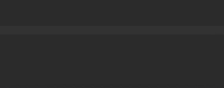

# Live templates for EcmaScript6

Set of shortcuts for common EcmaScript6 expressions

## Included templates

* **imf** - `import module from 'module'`
* **edc** - `export default class className`
* **edf** - `export default function functioName() {}`

Templates try to insert appropriate name according current file name.

## Installation

Paste content of the [templates.xml](templates.xml) on the `Settings -> Preferences -> Live templates` tab.
[Live templates](https://www.jetbrains.com/idea/help/sharing-live-templates.html) in IntelliJ documentation.
